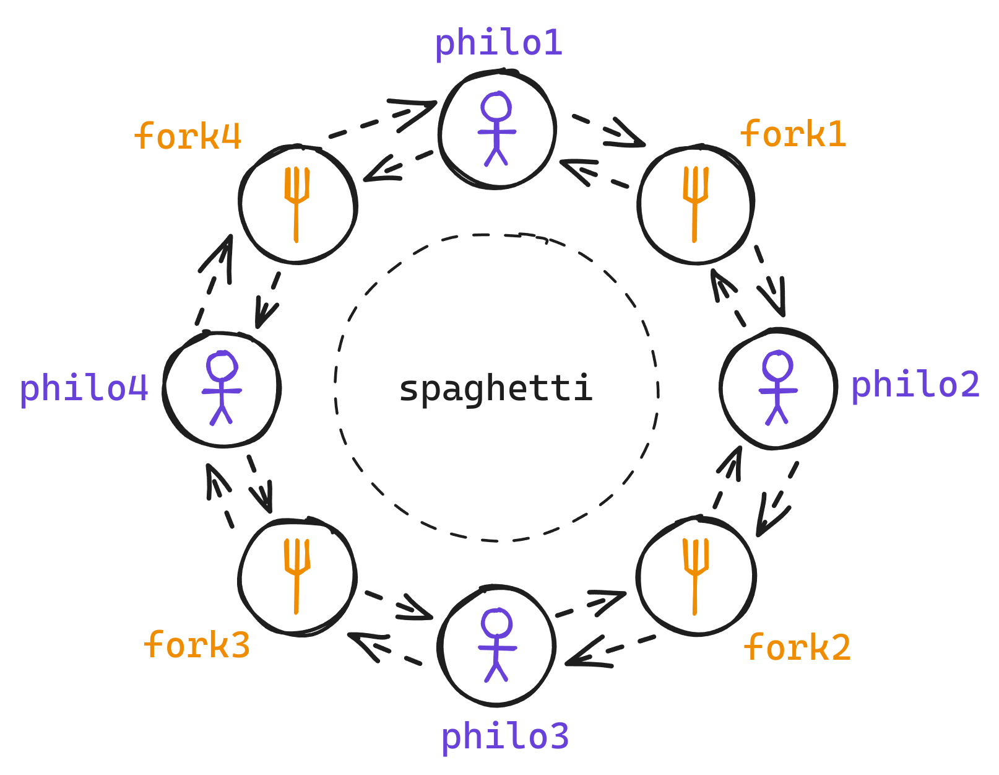

# philosophers

A simple implementation in C of the [philosophers problem](https://en.wikipedia.org/wiki/Dining_philosophers_problem).



## Brief description of the problem

The problem is to write a program that simulates a dinner party with N philosophers.

Each philosopher (philo) must eat, sleep and think:

- Can eat if he is not sleeping nor thinking.
- Can think if he is not eating nor sleeping.
- Can sleep if he is not eating nor thinking.

> [!NOTE]
> Only one philo can eat if has 2 forks (left and right).

## How to run

```bash
$ make
$ ./philo number_of_philosophers time_to_die time_to_eat time_to_sleep [number_of_times_each_philosopher_must_eat]
```

## Mandatory TO-DO

- [x] Add a `README.md` file
- [x] Add a `main.c` file
- [x] Create a Makefile
- [-] Handle errors
- [x] Parse the command line arguments
- [-] Implement the basic logic
